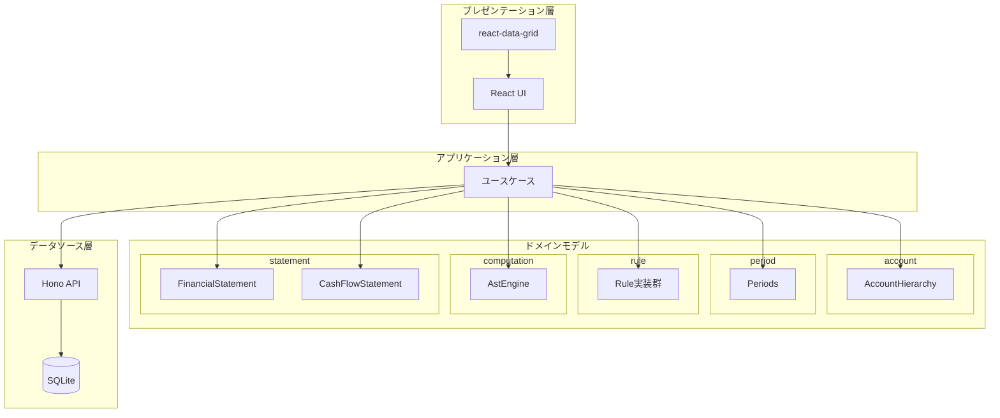
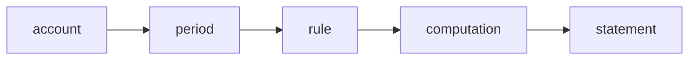
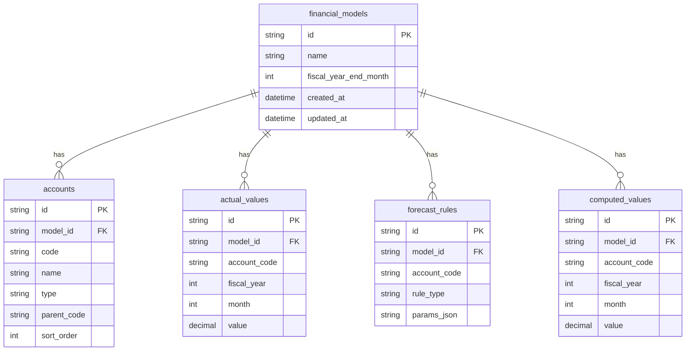
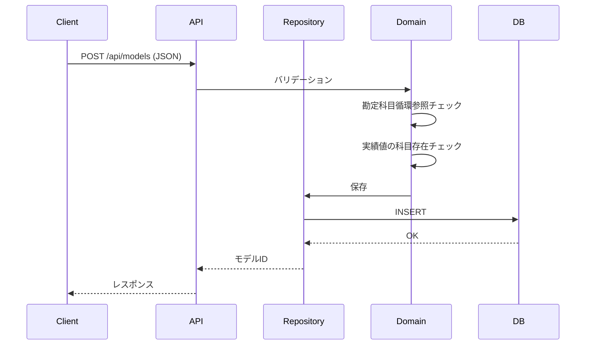
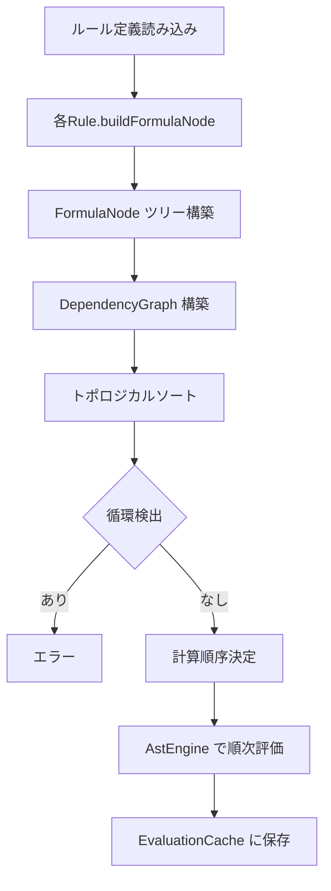
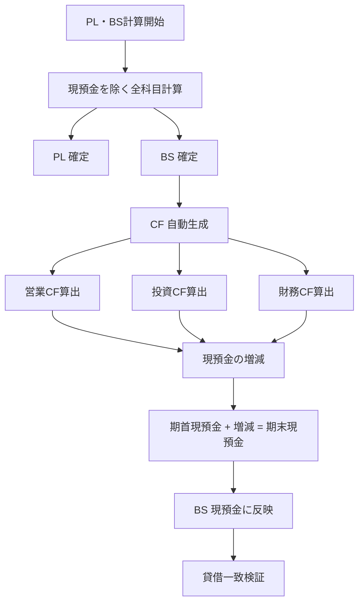
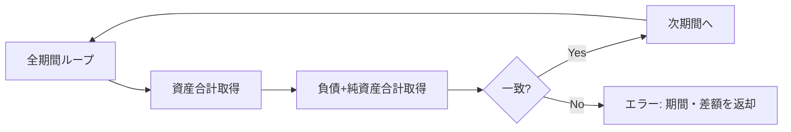
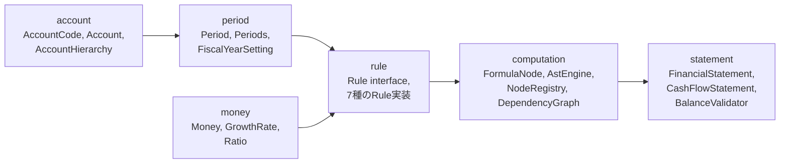
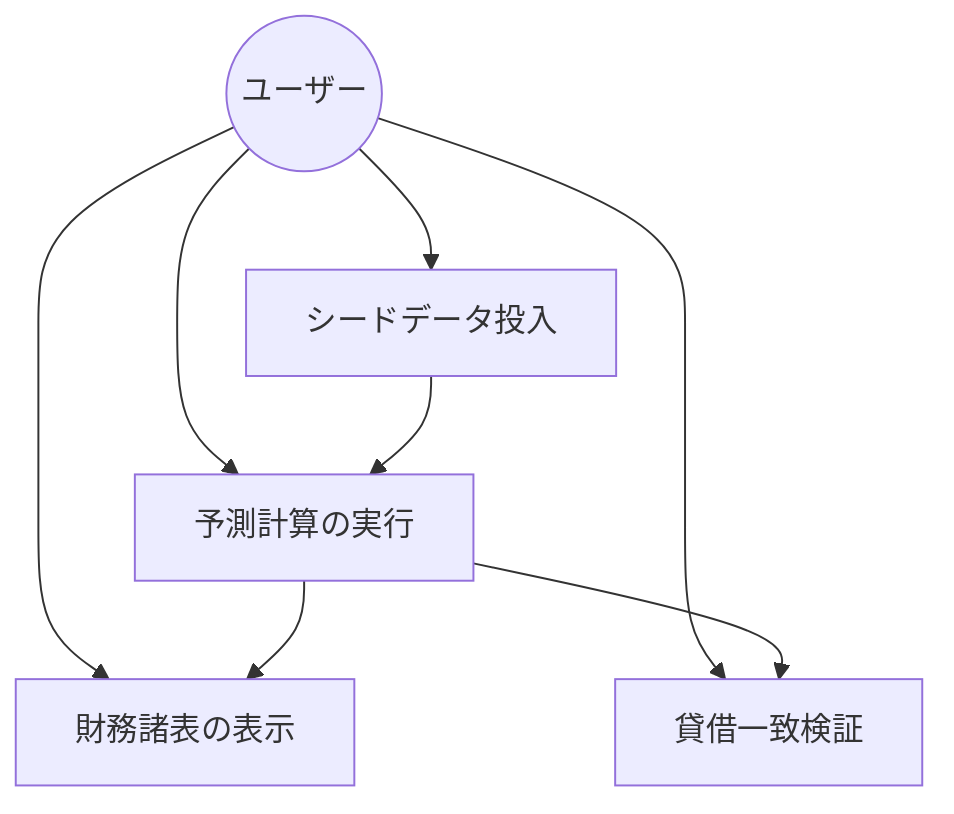
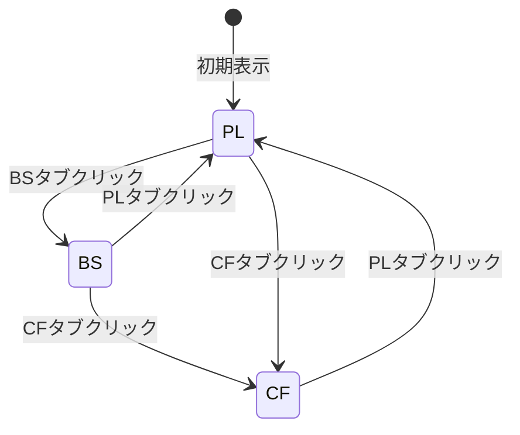

# SimpleFAM MVP 機能設計書

**Simple Financial Analysis Model**
product-requirements.md に基づく機能設計

Version 1.0 — 2026年3月

---

## 目次

1. [システム構成](#1-システム構成)
2. [データモデル定義](#2-データモデル定義)
3. [機能ごとのアーキテクチャ](#3-機能ごとのアーキテクチャ)
4. [コンポーネント設計](#4-コンポーネント設計)
5. [ユースケース](#5-ユースケース)
6. [画面設計](#6-画面設計)
7. [API設計](#7-api設計)

---

## 1. システム構成

### 1.1 レイヤー構成図

三層 + ドメインモデル方式を採用する。



### 1.2 パッケージ参照方向

```
account ← period ← rule ← computation ← statement
```



**禁止:** account が rule や computation を参照すること。上流パッケージは下流の存在を知らない。

### 1.3 システム全体構成

```
┌─────────────────────────────────────────────────────────────┐
│                    ブラウザ (Web UI)                         │
│  ┌─────────┐  ┌─────────┐  ┌─────────┐                       │
│  │ PL タブ │  │ BS タブ │  │ CF タブ │  react-data-grid     │
│  └─────────┘  └─────────┘  └─────────┘                       │
└───────────────────────────┬─────────────────────────────────┘
                            │ HTTP/REST
┌───────────────────────────▼─────────────────────────────────┐
│                   Hono API サーバー                          │
│  /api/models, /api/models/:id/statements/pl|bs|cf 等          │
└───────────────────────────┬─────────────────────────────────┘
                            │ Prisma ORM
┌───────────────────────────▼─────────────────────────────────┐
│                      SQLite                                  │
│  financial_models, accounts, actual_values, ...             │
└─────────────────────────────────────────────────────────────┘
```

---

## 2. データモデル定義

### 2.1 ER図



### 2.2 テーブル説明

| テーブル | 説明 | 主要カラム |
|---------|------|------------|
| financial_models | モデルのメタ情報 | id, name, fiscal_year_end_month |
| accounts | 勘定科目定義 | id, model_id, code, name, type, parent_code, sort_order |
| actual_values | 実績値 | id, model_id, account_code, fiscal_year, month, value |
| forecast_rules | 予測ルール | id, model_id, account_code, rule_type, params_json |
| computed_values | 計算結果のキャッシュ | id, model_id, account_code, fiscal_year, month, value |

---

## 3. 機能ごとのアーキテクチャ

### 3.1 FR-001: シードデータ投入



**処理フロー:**
1. JSONの構文・スキーマバリデーション
2. AccountHierarchy 構築 → 循環参照検出
3. actuals の科目コードが accounts に存在するか検証
4. 実績値は葉科目にのみ指定されているか検証
5. DBへ永続化

### 3.2 FR-002: 計算ルールによる将来値算出



**ルール適用順序:**
1. 各 Rule が `buildFormulaNode()` で AST ノードを構築
2. NodeRegistry でトポロジカルソート
3. 依存関係に従い計算実行
4. 結果をキャッシュに保存

### 3.3 FR-003: キャッシュフロー計算書の自動生成



**重要:** 現預金は CF から決定されるため、BS の他科目を先に計算してから CF を生成し、最後に現預金を確定する。

### 3.4 FR-004: 貸借一致検証



**検証式:** 資産合計(t) = 負債合計(t) + 純資産合計(t)

### 3.5 FR-005: 財務諸表の表示

```mermaid
flowchart TD
    A[API: statements/pl|bs|cf] --> B[Repository からデータ取得]
    B --> C[ドメインオブジェクト]
    C --> D[PlGridAdapter / BsGridAdapter / CfGridAdapter]
    D --> E[react-data-grid 形式に変換]
    E --> F[React コンポーネント]
    F --> G[グリッド表示]
```

**表示層の原則:** アダプターはドメイン→UI形式の変換のみ。業務ロジックは持たない。

---

## 4. コンポーネント設計

### 4.1 ドメイン層パッケージ構成（概観）

```
packages/domain/
├── account/           # 勘定科目
│   ├── AccountCode
│   ├── AccountName
│   ├── AccountType
│   ├── Account
│   └── AccountHierarchy
├── period/            # 会計期間
│   ├── Period
│   ├── Periods
│   └── FiscalYearSetting
├── money/             # 金額・比率
│   ├── Money
│   ├── GrowthRate
│   └── Ratio
├── rule/              # 計算ルール
│   ├── Rule (interface)
│   ├── ManualInputRule
│   ├── GrowthRateRule
│   ├── PercentageRule
│   ├── ReferenceRule
│   ├── BalanceChangeRule
│   ├── SumRule
│   └── SubtractRule
├── computation/       # 計算エンジン
│   ├── FormulaNode (階層)
│   ├── NodeRegistry
│   ├── DependencyGraph
│   └── AstEngine
└── statement/         # 財務諸表
    ├── FinancialStatement
    └── CashFlowStatement
```

### 4.2 account パッケージ — 勘定科目

勘定科目の定義と階層構造を管理する。最上流パッケージのため、他パッケージへの依存は持たない。

#### AccountCode（値オブジェクト）

科目を一意に識別する文字列ラッパー。

```typescript
class AccountCode {
  readonly value: string;

  private constructor(value: string);

  static of(value: string): AccountCode;        // ファクトリ。空文字・不正形式はエラー
  equals(other: AccountCode): boolean;           // 値の同一性比較
  toString(): string;
}
```

#### AccountName（値オブジェクト）

科目名（日本語名）のラッパー。

```typescript
class AccountName {
  readonly value: string;

  static of(value: string): AccountName;
  toString(): string;
}
```

#### AccountType（値オブジェクト / Union型）

PL / BS / CF の区分を示す。

```typescript
type AccountType = "PL" | "BS" | "CF";
```

#### AccountSide（値オブジェクト / Union型）

借方 / 貸方の区分を示す。

```typescript
type AccountSide = "DEBIT" | "CREDIT";
```

| AccountType | Side | 例 |
|---|---|---|
| PL | CREDIT | 売上高（収益） |
| PL | DEBIT | 売上原価、販管費（費用） |
| BS | DEBIT | 現金、固定資産（資産） |
| BS | CREDIT | 買掛金、借入金（負債）、純資産 |
| CF | DEBIT | 営業CF増加項目 |
| CF | CREDIT | 営業CF減少項目 |

#### Account（エンティティ）

1つの勘定科目を表すエンティティ。

```typescript
class Account {
  readonly code: AccountCode;
  readonly name: AccountName;
  readonly type: AccountType;
  readonly side: AccountSide;                    // 借方/貸方
  readonly parentCode: AccountCode | null;       // null = ルート科目
  readonly sortOrder: number;
  readonly isStructural: boolean;                // 構造科目フラグ

  static create(params: {
    code: string;
    name: string;
    type: AccountType;
    side: AccountSide;
    parentCode: string | null;
    sortOrder: number;
    isStructural?: boolean;                      // デフォルト: false
  }): Account;

  get aggregationSign(): 1 | -1;                 // DEBIT → +1, CREDIT → -1
  isRoot(): boolean;                             // parentCode === null
  belongsTo(type: AccountType): boolean;
  changeParent(newParentCode: AccountCode | null): Account;  // 構造科目はエラー
}
```

#### AccountHierarchy（コレクションオブジェクト）

Account の集合を木構造で管理する。配列の直接操作を禁止し、業務メソッドを通じてアクセスする。

```typescript
class AccountHierarchy {
  private readonly accounts: ReadonlyMap<string, Account>;
  private readonly childMap: ReadonlyMap<string, AccountCode[]>;

  static build(accounts: Account[]): AccountHierarchy;  // 循環参照検出付き

  getByCode(code: AccountCode): Account;                // 存在しない場合はエラー
  getChildren(code: AccountCode): Account[];             // 直接の子科目を取得
  getLeaves(): Account[];                                // 葉科目（子を持たない）一覧
  getByType(type: AccountType): Account[];               // PL/BS/CF別に取得
  getRoots(): Account[];                                 // ルート科目一覧
  isLeaf(code: AccountCode): boolean;                    // 葉科目かどうか
  getDepth(code: AccountCode): number;                   // 階層の深さ（ルート=0）
  toSorted(): Account[];                                 // sortOrder順のフラット配列
  getAllAccounts(): Account[];                            // 全科目の配列

  // 構造変更メソッド（新しい AccountHierarchy を返す）
  insertParentAbove(newParent: Account, childCodes: AccountCode[]): AccountHierarchy;
  addChildrenTo(targetCode: AccountCode, newChildren: Account[]): AccountHierarchy;

  private detectCycle(): void;                           // 循環参照時にエラーをスロー
}
```

### 4.3 period パッケージ — 会計期間

account パッケージのみ参照可。

#### Period（値オブジェクト）

特定の会計年度の特定月を表す。

```typescript
class Period {
  readonly fiscalYear: number;                   // 会計年度（例: 2024）
  readonly month: number;                        // 月（1〜12）

  static of(fiscalYear: number, month: number): Period;

  equals(other: Period): boolean;
  next(): Period;                                // 次の月の Period を返す
  prev(): Period;                                // 前の月の Period を返す
  toLabel(): string;                             // 表示用ラベル（例: "FY2024/4"）
  compareTo(other: Period): number;              // ソート用（-1, 0, 1）
}
```

#### FiscalYearSetting（値オブジェクト）

決算期の設定を保持する。

```typescript
class FiscalYearSetting {
  readonly fiscalYearEndMonth: number;           // 決算月（例: 3月決算 → 3）
  readonly actualPeriodCount: number;            // 実績期数（年数）
  readonly forecastPeriodCount: number;          // 予測期数（年数）

  static of(params: {
    fiscalYearEndMonth: number;
    actualPeriodCount: number;
    forecastPeriodCount: number;
  }): FiscalYearSetting;

  getStartMonth(): number;                      // 期首月（例: 3月決算 → 4）
  isActualPeriod(period: Period): boolean;       // 実績期間に含まれるか
  isForecastPeriod(period: Period): boolean;     // 予測期間に含まれるか
}
```

#### Periods（コレクションオブジェクト）

会計期間の列を管理する。

```typescript
class Periods {
  private readonly periods: readonly Period[];

  static generate(setting: FiscalYearSetting): Periods;  // 設定から全期間を自動生成

  getAll(): readonly Period[];
  getActuals(): readonly Period[];                         // 実績期間のみ
  getForecasts(): readonly Period[];                       // 予測期間のみ
  getLabels(): string[];                                   // 表示用ラベルの配列
  contains(period: Period): boolean;
  first(): Period;
  last(): Period;
  count(): number;
}
```

### 4.4 money パッケージ — 金額・比率

他パッケージ非依存のユーティリティ的パッケージ。

#### Money（値オブジェクト）

単位付きの金額。

```typescript
class Money {
  readonly amount: number;

  static of(amount: number): Money;
  static zero(): Money;

  add(other: Money): Money;
  subtract(other: Money): Money;
  multiply(factor: number): Money;               // 割合・成長率との掛け算
  negate(): Money;                                // 符号反転
  isZero(): boolean;
  equals(other: Money): boolean;
  toDisplay(unit?: "thousands" | "millions"): string;  // 表示用フォーマット
}
```

#### GrowthRate（値オブジェクト）

成長率。前期比の増減率を表す。

```typescript
class GrowthRate {
  readonly rate: number;                          // 例: 0.05 = 5%

  static of(rate: number): GrowthRate;

  apply(base: Money): Money;                      // base × (1 + rate) を返す
  toPercentString(): string;                      // "5.0%" のような表示用
}
```

#### Ratio（値オブジェクト）

割合。参照科目に対する百分率を表す。

```typescript
class Ratio {
  readonly value: number;                         // 例: 0.70 = 70%

  static of(value: number): Ratio;

  apply(base: Money): Money;                      // base × value を返す
  toPercentString(): string;                      // "70.0%" のような表示用
}
```

### 4.5 rule パッケージ — 計算ルール

account, period, money パッケージを参照する。各 Rule は自ら FormulaNode を構築する責務を持つ。

#### Rule（インターフェース）

全ルールの共通契約。

```typescript
interface Rule {
  readonly accountCode: AccountCode;
  readonly ruleType: RuleType;

  buildFormulaNode(
    period: Period,
    context: RuleBuildContext,
  ): FormulaNode;
}

type RuleType =
  | "MANUAL_INPUT"
  | "GROWTH_RATE"
  | "PERCENTAGE"
  | "REFERENCE"
  | "BALANCE_CHANGE"
  | "SUM"
  | "SUBTRACT";
```

#### RuleBuildContext

ルールが FormulaNode 構築時に参照できるコンテキスト。

```typescript
interface RuleBuildContext {
  getNodeRef(accountCode: AccountCode, period: Period): FormulaNodeRef;
  getHierarchy(): AccountHierarchy;
}
```

#### ManualInputRule

```typescript
class ManualInputRule implements Rule {
  readonly accountCode: AccountCode;
  readonly ruleType = "MANUAL_INPUT" as const;
  private readonly value: Money;

  buildFormulaNode(period: Period, context: RuleBuildContext): FormulaNode;
  // → ConstantNode(value) を返す
}
```

#### GrowthRateRule

```typescript
class GrowthRateRule implements Rule {
  readonly accountCode: AccountCode;
  readonly ruleType = "GROWTH_RATE" as const;
  private readonly growthRate: GrowthRate;

  buildFormulaNode(period: Period, context: RuleBuildContext): FormulaNode;
  // → MultiplyNode(prevPeriodRef, 1 + rate) を返す
  // 依存: 同科目の前期ノード
}
```

#### PercentageRule

```typescript
class PercentageRule implements Rule {
  readonly accountCode: AccountCode;
  readonly ruleType = "PERCENTAGE" as const;
  private readonly referenceAccount: AccountCode;
  private readonly ratio: Ratio;

  buildFormulaNode(period: Period, context: RuleBuildContext): FormulaNode;
  // → MultiplyNode(referenceAccountRef, ratio) を返す
  // 依存: 参照科目の同期ノード
}
```

#### ReferenceRule

```typescript
class ReferenceRule implements Rule {
  readonly accountCode: AccountCode;
  readonly ruleType = "REFERENCE" as const;
  private readonly referenceAccount: AccountCode;
  private readonly referencePeriodOffset: number;  // 0=同期, -1=前期

  buildFormulaNode(period: Period, context: RuleBuildContext): FormulaNode;
  // → ReferenceNode(referenceAccountRef) を返す
}
```

#### BalanceChangeRule

```typescript
class BalanceChangeRule implements Rule {
  readonly accountCode: AccountCode;
  readonly ruleType = "BALANCE_CHANGE" as const;
  private readonly changeSourceAccount: AccountCode;

  buildFormulaNode(period: Period, context: RuleBuildContext): FormulaNode;
  // → AddNode(prevPeriodBalanceRef, changeAmount) を返す
  // 依存: 同科目の前期ノード + 増減元科目の同期ノード
}
```

#### SumRule

```typescript
class SumRule implements Rule {
  readonly accountCode: AccountCode;
  readonly ruleType = "SUM" as const;

  buildFormulaNode(period: Period, context: RuleBuildContext): FormulaNode;
  // → AddNode(child1Ref, child2Ref, ...) を返す
  // AccountHierarchy から子科目を取得し合算
}
```

#### SubtractRule

```typescript
class SubtractRule implements Rule {
  readonly accountCode: AccountCode;
  readonly ruleType = "SUBTRACT" as const;
  private readonly minuend: AccountCode;           // 被減数
  private readonly subtrahend: AccountCode;        // 減数

  buildFormulaNode(period: Period, context: RuleBuildContext): FormulaNode;
  // → SubtractNode(minuendRef, subtrahendRef) を返す
}
```

### 4.6 computation パッケージ — 計算エンジン

account, period, money, rule パッケージを参照する。ASTによる式の構築と依存解決・評価を行う。

#### FormulaNode（抽象構文木ノード階層）

```typescript
// 全ノードの基底
interface FormulaNode {
  readonly nodeId: string;                         // ユニーク識別子
  evaluate(cache: EvaluationCache): Money;
  getDependencies(): FormulaNodeRef[];             // このノードが依存する他ノード
}

// 他ノードへの参照（遅延評価用）
interface FormulaNodeRef {
  readonly accountCode: AccountCode;
  readonly period: Period;
  resolve(registry: NodeRegistry): FormulaNode;
}
```

**具体ノード一覧:**

```typescript
class ConstantNode implements FormulaNode {
  constructor(nodeId: string, value: Money);
  evaluate(cache: EvaluationCache): Money;         // → value をそのまま返す
  getDependencies(): [];                           // 依存なし
}

class AddNode implements FormulaNode {
  constructor(nodeId: string, operands: FormulaNodeRef[]);
  evaluate(cache: EvaluationCache): Money;         // → 全operandの合計
  getDependencies(): FormulaNodeRef[];
}

class SubtractNode implements FormulaNode {
  constructor(nodeId: string, minuend: FormulaNodeRef, subtrahend: FormulaNodeRef);
  evaluate(cache: EvaluationCache): Money;         // → minuend - subtrahend
  getDependencies(): FormulaNodeRef[];
}

class MultiplyNode implements FormulaNode {
  constructor(nodeId: string, base: FormulaNodeRef, factor: number);
  evaluate(cache: EvaluationCache): Money;         // → base × factor
  getDependencies(): FormulaNodeRef[];
}

class ReferenceNode implements FormulaNode {
  constructor(nodeId: string, ref: FormulaNodeRef);
  evaluate(cache: EvaluationCache): Money;         // → ref の値をそのまま返す
  getDependencies(): FormulaNodeRef[];
}

class NegateNode implements FormulaNode {
  constructor(nodeId: string, operand: FormulaNodeRef);
  evaluate(cache: EvaluationCache): Money;         // → -operand
  getDependencies(): FormulaNodeRef[];
}
```

#### EvaluationCache

```typescript
class EvaluationCache {
  private readonly cache: Map<string, Money>;

  get(nodeId: string): Money | undefined;
  set(nodeId: string, value: Money): void;
  has(nodeId: string): boolean;
  clear(): void;
}
```

#### NodeRegistry（コレクションオブジェクト）

全 FormulaNode を管理し、ID ベースで引ける。

```typescript
class NodeRegistry {
  private readonly nodes: Map<string, FormulaNode>;

  register(node: FormulaNode): void;
  getOrCreate(
    accountCode: AccountCode,
    period: Period,
    factory: () => FormulaNode,
  ): FormulaNode;
  get(nodeId: string): FormulaNode;
  getAll(): FormulaNode[];

  static buildNodeId(accountCode: AccountCode, period: Period): string;
}
```

#### DependencyGraph

ノード間の依存関係をグラフとして管理し、トポロジカルソートを提供する。

```typescript
class DependencyGraph {
  static build(registry: NodeRegistry): DependencyGraph;

  topologicalSort(): FormulaNode[];                // 計算順序を返す
  detectCycle(): AccountCode[] | null;             // 循環があれば関与する科目を返す
}
```

#### AstEngine

計算の実行エンジン。

```typescript
class AstEngine {
  private readonly registry: NodeRegistry;
  private readonly cache: EvaluationCache;

  static create(): AstEngine;

  registerRules(
    rules: Rule[],
    periods: Periods,
    actuals: Map<string, Money>,                   // nodeId → 実績値
    context: RuleBuildContext,
  ): void;

  compute(): ComputationResult;                    // 全ノードを依存順に評価

  getValue(accountCode: AccountCode, period: Period): Money;
}

interface ComputationResult {
  readonly values: ReadonlyMap<string, Money>;     // nodeId → Money
  readonly errors: readonly ComputationError[];
}

interface ComputationError {
  readonly accountCode: AccountCode;
  readonly period: Period;
  readonly message: string;
}
```

### 4.7 statement パッケージ — 財務諸表

全パッケージを参照する。PL/BS/CF の構造化と表示用データの提供を行う。

#### StatementLine

財務諸表の1行（科目 × 期間の値の列）を表す。

```typescript
interface StatementLine {
  readonly account: Account;
  readonly level: number;                          // インデント深さ
  readonly values: ReadonlyMap<Period, Money>;
}
```

#### FinancialStatement

PL または BS のデータ構造。

```typescript
class FinancialStatement {
  readonly type: "PL" | "BS";
  readonly lines: readonly StatementLine[];
  readonly periods: Periods;

  static buildPl(
    hierarchy: AccountHierarchy,
    periods: Periods,
    engine: AstEngine,
  ): FinancialStatement;

  static buildBs(
    hierarchy: AccountHierarchy,
    periods: Periods,
    engine: AstEngine,
  ): FinancialStatement;

  getLine(code: AccountCode): StatementLine;
  getValue(code: AccountCode, period: Period): Money;
}
```

#### CashFlowStatement

間接法CFを表す。PL と BS のデータから自動生成される。

```typescript
class CashFlowStatement {
  readonly lines: readonly CfLine[];
  readonly periods: Periods;

  static generate(
    pl: FinancialStatement,
    bs: FinancialStatement,
    periods: Periods,
  ): CashFlowStatement;

  getOperatingCf(period: Period): Money;
  getInvestingCf(period: Period): Money;
  getFinancingCf(period: Period): Money;
  getNetCashChange(period: Period): Money;         // 営業 + 投資 + 財務
  getEndingCash(period: Period): Money;            // 期首 + 純増減
}

interface CfLine {
  readonly label: string;
  readonly category: "OPERATING" | "INVESTING" | "FINANCING" | "TOTAL";
  readonly values: ReadonlyMap<Period, Money>;
}
```

#### BalanceValidator

貸借一致を検証するドメインサービス。

```typescript
class BalanceValidator {
  static validate(
    bs: FinancialStatement,
    periods: Periods,
  ): ValidationResult;
}

interface ValidationResult {
  readonly isValid: boolean;
  readonly errors: readonly BalanceError[];
}

interface BalanceError {
  readonly period: Period;
  readonly assetTotal: Money;
  readonly liabilityEquityTotal: Money;
  readonly difference: Money;
}
```

### 4.8 パッケージ間依存のまとめ



**各パッケージのインポートルール:**

| パッケージ | 参照してよいパッケージ |
|------------|------------------------|
| account | なし |
| money | なし |
| period | account |
| rule | account, period, money |
| computation | account, period, money, rule |
| statement | account, period, money, rule, computation |

### 4.9 不変性の実現方針

全値オブジェクトで以下のパターンを適用する。

```typescript
// 1. readonly プロパティ + private constructor + static ファクトリ
class AccountCode {
  readonly value: string;
  private constructor(value: string) {
    this.value = value;
    Object.freeze(this);
  }
  static of(value: string): AccountCode {
    if (!value || value.trim() === "") {
      throw new Error("AccountCode must not be empty");
    }
    return new AccountCode(value);
  }
}

// 2. コレクションは readonly 配列 / ReadonlyMap で公開
class AccountHierarchy {
  private readonly accounts: ReadonlyMap<string, Account>;
  // ... 外部には readonly 配列 / 単一オブジェクトでのみ公開
}
```

### 4.11 表示層アダプター

| アダプター | 責務 | 入力 | 出力 |
|------------|------|------|------|
| PlGridAdapter | PL をグリッド形式に変換 | FinancialStatement (PL) | react-data-grid 用の rows/columns |
| BsGridAdapter | BS をグリッド形式に変換 | FinancialStatement (BS) | react-data-grid 用の rows/columns |
| CfGridAdapter | CF をグリッド形式に変換 | CashFlowStatement | react-data-grid 用の rows/columns |

### 4.12 サーバー層

| コンポーネント | 責務 |
|----------------|------|
| ルートハンドラー | HTTP リクエストの受付、レスポンス返却 |
| Repository | ドメインオブジェクト ⇔ DB テーブルの変換 |
| Prisma Client | SQLite へのアクセス |

---

## 5. ユースケース

### 5.1 ユースケース図



### 5.2 ユースケース一覧

| ID | ユースケース | 概要 |
|----|--------------|------|
| UC-01 | シードデータ投入 | JSON で勘定科目・実績値・ルールを登録 |
| UC-02 | 予測計算の実行 | ルールに基づき将来値を算出、CF 生成、現預金確定 |
| UC-03 | 財務諸表の表示 | PL / BS / CF をグリッドで表示 |
| UC-04 | 貸借一致検証 | 全期間の資産=負債+純資産を検証 |

---

## 6. 画面設計

### 6.1 画面遷移図

MVP は単一画面。タブによる切替のみ。



### 6.2 ワイヤフレーム

```
┌─────────────────────────────────────────────────────────────────────────┐
│  SimpleFAM MVP                                    [モデル選択 ▼]         │
├─────────────────────────────────────────────────────────────────────────┤
│  [ PL ]  [ BS ]  [ CF ]                                                  │
├─────────────────────────────────────────────────────────────────────────┤
│               │ FY2024/4  │ FY2024/5  │ ... │ FY2025/3  │ FY2025/4  │ ... │
│               │ (実績)    │ (実績)    │     │ (実績)    │ (予測)    │     │
├───────────────┼───────────┼───────────┼─────┼───────────┼───────────┼─────┤
│ 売上高        │  1,000    │  1,050    │ ... │  1,200    │  1,260    │ ... │
│ 売上原価      │    700    │    735    │ ... │    840    │    882    │ ... │
│ 売上総利益    │    300    │    315    │ ... │    360    │    378    │ ... │
│   ...         │   ...     │   ...     │     │   ...     │   ...     │     │
└─────────────────────────────────────────────────────────────────────────┘

凡例: 実績期間=白背景 / 予測期間=薄いグレー背景
```

### 6.3 表示仕様

| 項目 | 仕様 |
|------|------|
| 行 | 勘定科目（階層はインデントで表現） |
| 列 | 会計期間（FiscalYearSetting に基づくラベル） |
| セル値 | 金額（千円 or 百万円単位） |
| 実績/予測 | 背景色で区別 |
| タブ | PL / BS / CF の切替 |

---

## 7. API設計

### 7.1 エンドポイント一覧

| メソッド | パス | 説明 |
|----------|------|------|
| POST | /api/models | モデル新規作成（シードデータ投入） |
| GET | /api/models/:id | モデル情報の取得 |
| GET | /api/models/:id/statements/pl | PL データ取得 |
| GET | /api/models/:id/statements/bs | BS データ取得 |
| GET | /api/models/:id/statements/cf | CF データ取得 |
| PUT | /api/models/:id/rules | 予測ルールの更新 |
| POST | /api/models/:id/calculate | 再計算の実行 |
| GET | /api/models/:id/validate | 貸借一致検証 |

### 7.2 リクエスト/レスポンススキーマ

#### POST /api/models — モデル作成

**Request Body:**
```json
{
  "fiscalYearSetting": {
    "fiscalYearEndMonth": 3,
    "actualPeriodCount": 2,
    "forecastPeriodCount": 3
  },
  "accounts": [
    { "code": "revenue", "name": "売上高", "type": "PL", "parentCode": null, "sortOrder": 1 },
    ...
  ],
  "actuals": [
    { "accountCode": "revenue", "fiscalYear": 2024, "month": 4, "value": 1000000 },
    ...
  ],
  "forecastRules": [
    { "accountCode": "revenue", "ruleType": "GROWTH_RATE", "params": { "rate": 0.05 } },
    ...
  ]
}
```

**Response (201 Created):**
```json
{
  "id": "model-uuid",
  "name": "モデル名",
  "fiscalYearEndMonth": 3,
  "validationResult": {
    "isValid": true,
    "errors": []
  }
}
```

**Error Response (400 Bad Request):**
```json
{
  "error": "VALIDATION_ERROR",
  "message": "勘定科目に循環参照が存在します",
  "details": { "accountCodes": ["revenue", "cogs"] }
}
```

#### GET /api/models/:id/statements/pl — PL 取得

**Response (200 OK):**
```json
{
  "rows": [
    { "accountCode": "revenue", "label": "売上高", "level": 0, "values": { "2024-04": 1000, "2024-05": 1050, ... } },
    { "accountCode": "cogs", "label": "売上原価", "level": 0, "values": { ... } },
    ...
  ],
  "columns": ["2024-04", "2024-05", ..., "2025-04", ...],
  "periodTypes": { "2024-04": "actual", "2025-04": "forecast", ... }
}
```

#### GET /api/models/:id/validate — 貸借一致検証

**Response (200 OK) — 正常時:**
```json
{
  "isValid": true,
  "errors": []
}
```

**Response (200 OK) — 不一致時:**
```json
{
  "isValid": false,
  "errors": [
    { "period": "2025-03", "assetTotal": 1000000, "liabilityEquityTotal": 998000, "difference": 2000 }
  ]
}
```

### 7.3 エラーレスポンス形式

| HTTP Status | 説明 |
|-------------|------|
| 400 | バリデーションエラー（リクエスト不正） |
| 404 | モデルが存在しない |
| 500 | サーバー内部エラー |

共通エラー形式:
```json
{
  "error": "ERROR_CODE",
  "message": "人間が読めるメッセージ",
  "details": {}
}
```

---

*— End of Document —*
